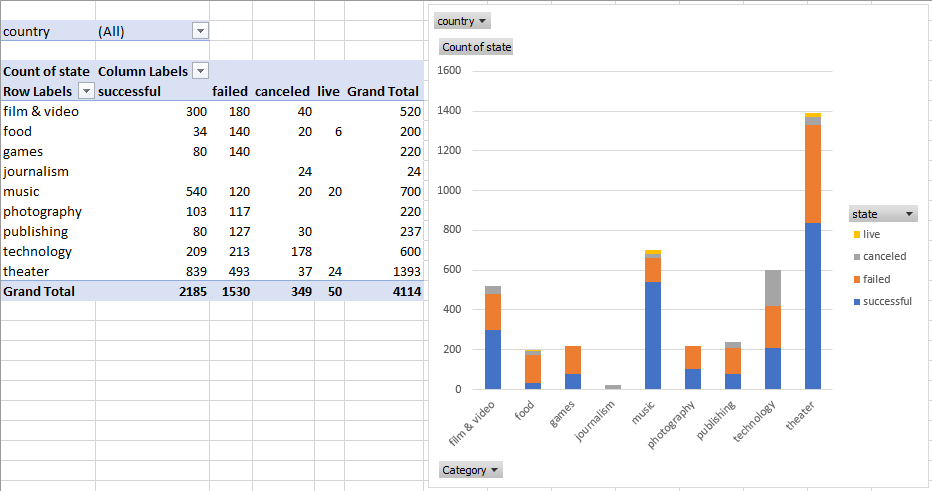
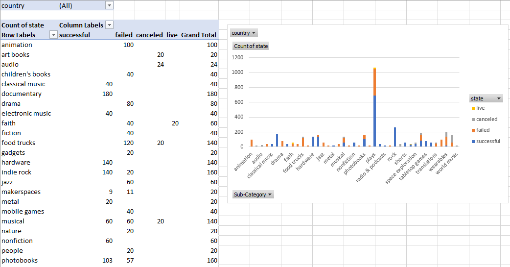
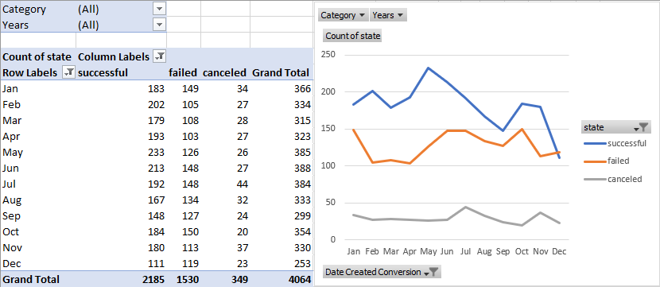
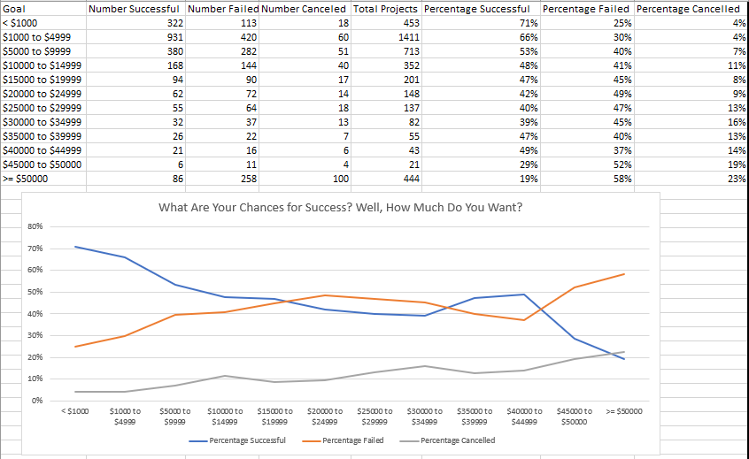

# Unit 1 Homework: Kickstart My Chart

## Assignment Background:

Over $2 billion has been raised using the massively successful crowdfunding service, Kickstarter, but not every project has found success. Of the more than 300,000 projects launched on Kickstarter, only a third have made it through the funding process with a positive outcome.

Getting funded on Kickstarter requires meeting or exceeding the project's initial goal, so many organizations spend months looking through past projects in an attempt to discover some trick for finding success. For this week's homework, you will organize and analyze a database of 4,000 past projects in order to uncover any hidden trends.

## Table Analysis

Using the Excel document, I modified and analyzed Kickstarter project data to find trends. This project focused on utilizing formulas, conditional formatting, pivot tables, and pivot charts to analyze the data.

* Formulas were used to calculate `Percent Funded` and `Average Donation` columns within the data, and to split the `Category and Sub-Category` column into `Category` and `Sub-Category` columns for further analysis. I also used a formulas to convert the  `deadline`, `launched_at`, `Date Created Conversion`, and `Date Ended Conversion` columns into normal date values within the document.

* Conditional formatting was used to color-coordinate the data, distinguishing the live, successful, failed, or cancelled Kickstarter projects. I also used the conditional formatting to describe each project's funding percentage, accounting for overfunded (surplus funding) projects. 

## Pivot Table

Using Pivot tables, I dove into the data starting with the category/status relationship. I wanted to see the spread of categories across the data, and the success/failure rates for each category. To my surprise, the categories theater, film, and music topped the dataset with the most entries and the most successes within the data, as seen in the image below.

From there, I dug a little deeper into the sub-categories. Plays made up the vast majority of the entries and successes, eclipsing most of the data by close to a factor of 10. Furthermore, I was surprised by the amount of categories that had 100% failure rates, such as animation, children's books, and video games.

Finally, I decided to see if there were any trends per year with the data. The generated pivot table allows users to analyze categorical trends across years and year ranges. I was unable to find any deep trends, but it is worth noting the steep increase in successful projects in May compared to the steep decline in December. 

## Observations and Further Analysis

Finally, I was tasked to see how the goal range influenced the success/failure/cancellation rate for Kickstarter projects in general. As seen above, the most successful projects tend to have a lower goal.

Success also trumps failure until approximately the $15,000 - $19,999 range, where failure rate rises above success rate. Success also plummets towards the upper range of the data, suggesting projects with lofty goals succeed far less often than they fail or are cancelled outright.

While completing this assignment, I was given three questions to keep in mind:

1. **Given the provided data, what are three conclusions we can draw about Kickstarter campaigns?**
   * According to the data, most Kickstarter campaigns tend to focus on media and entertainment (Music, Theater, Technology, and Film & Video are the top 5), with most of the successful campaigns coming from the Theater/Plays category and subcategory. 
   * Lower cost projects tend to reach their goals more successfully compared to projects that require large sums. 

2. **What are some limitations of this dataset?**
   * One limitation for this dataset that the dataset does not account for tiered donations. Some Kickstart campaigns offer incentives to donors depending on how much they donate, which can range from a simple thank you to personalized items or even shares in the company in some cases. I would’ve liked to see this information, if possible, to see how if there are tends in tier popularity based on its cost, and to see if this information agrees with the calculated average donation value I calculated, though I doubt it would agree entirely.

3. **What are some other possible tables and/or graphs that we could create?**
   * I could dig even deeper to see if staff-pick and spotlights have any impact on the successfulness of a project as well. I could also analyze the duration of each project to see if success rates vary if a project has a long donation window or a shorter one. 

Please feel free to delve into the included Excel workbook for more.

- - -

© 2019 Trilogy Education Services
